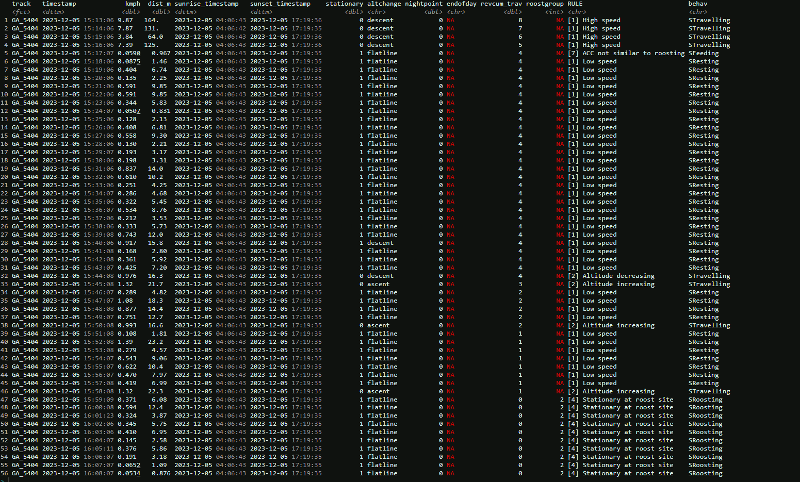
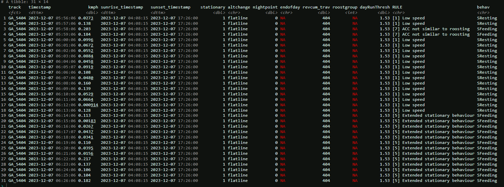
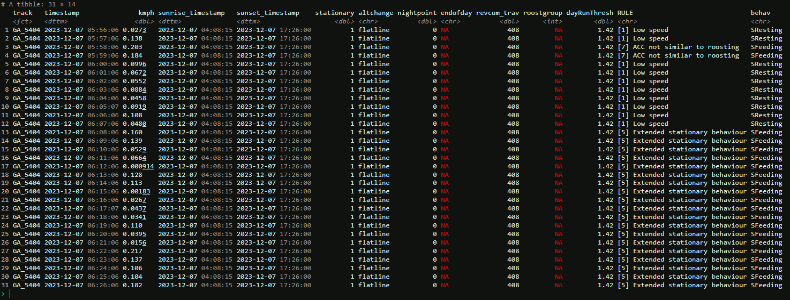
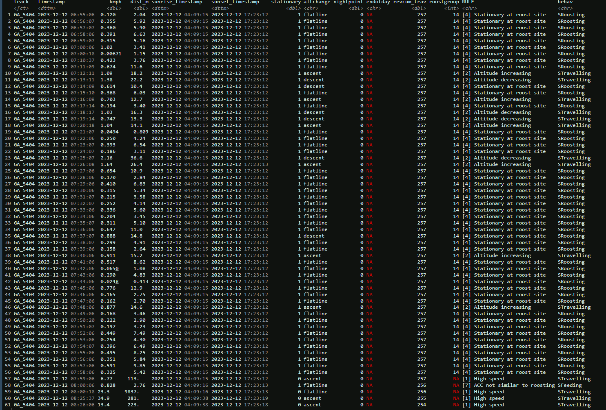

# Updating stationary points based on change in altitude classification


- [Introduction](#introduction)
- [Update stationary status and relocate roosting site
  identification](#update-stationary-status-and-relocate-roosting-site-identification)
- [Update stationary status and use it to fit speed-time model (instead
  of
  `travelcut`)](#update-stationary-status-and-use-it-to-fit-speed-time-model-instead-of-travelcut)
- [All changes combined](#all-changes-combined)

## Introduction

Here we document the impact in the behaviour classification process from
enforcing the update of the stationary status after the altitude
classification step \[2\]. This is related to issue
[\#11](https://github.com/dmpstats/Behavioural_Classification_for_Vultures/issues/11).

As explained in the issue page, implementing this update implies the
following structural changes to the classification code[^1]:

1.  Include an update on `stationary` status after the altitude
    classification step \[2\], turning any newly classified
    `behav == "STravelling"` event as `stationary == 0` [^2].

2.  Relocate roosting-site identification somewhere after \[2\],
    otherwise the roosting identification will be outdated. Roost-siting
    code was placed as a pre-step of the roost-site classification step
    \[4\] [^3].

3.  Speed-time model also modified to fit to `stationary == 1` entries
    (instead of those `kmph < travelcut`) and relocated as a pre-step of
    the speed-model classification step \[6\] (i.e. after the altitude
    classification step)

Next, we look into the impact of each of the above changes in terms of
the final distribution of behaviour across the considered categories.

#### Upload test datasets

``` r
# Read (encrypted) input datasets for testing
test_dt <- secret_read_rds("../../data/raw/vult_test_data.rds", key = I(app_key))
```

``` r
test_dt$metadata |> knitr::kable()
```

| object_name | study_name                       | gps_frwq | acc   | acc_freq | ndays | n_animals | n_events | alt_avail |
|:------------|:---------------------------------|:---------|:------|:---------|------:|----------:|---------:|:----------|
| nam_sop     | AVulture Namibia SOP             | 1m       | mixed | 1m       |    15 |         5 |    43395 | TRUE      |
| gaia        | GAIA Vulture                     | 1s; 3m   | mixed | 1s       |    15 |         6 |    74097 | TRUE      |
| savahn      | ASavannah-MEFT                   | 35m      | no    | NA       |    27 |         5 |     3015 | FALSE     |
| pan_afr     | pan-africa Vultures              | 1h; 36h  | no    | NA       |    15 |         2 |      200 | FALSE     |
| ken_tnz     | Gyps africanus Kendall Tanzania  | 30m; 1h  | no    | NA       |    32 |         5 |     3382 | TRUE      |
| wcs         | WCS Ruaha-Katavi Vultures        | 1h       | no    | NA       |    32 |         3 |     1387 | FALSE     |
| wb_zam_knd  | WhitebackedVulturesZambiaKendall | 30m; 1h  | no    | NA       |    36 |        12 |     7213 | TRUE      |
| sa_vfa      | South Africa vultures VfA MPIAB  | 15m      | yes   | 5m       |    30 |         3 |     4425 | TRUE      |

## Update stationary status and relocate roosting site identification

Running previous (`RFunction_old()`) and modified
(`RFunction_roost_reloc()`) versions of the App and compare results in
term of:

- `stnry_vs_behav`: two-way comparison for events annotated to each
  behaviour relative to their stationary status
- `classif_contrast`: Percentage change between the two code versions

``` r
# thinning gaia dataset for 1min gaps
test_dt$gaia <- mt_filter_per_interval(test_dt$gaia, unit = "1 min")

dt_names <- test_dt$metadata |> 
  filter(alt_avail == TRUE) |> 
  pull(object_name) 

roost_reloc <- imap(
  test_dt[dt_names],
  \(dt, dt_name){
    
    message(paste0("\nPerforming comparison for dataset ", dt_name, "\n"))
    
    compare_versions(
      dt = dt,
      f_old = rFunction_old, 
      f_new = rFunction_roost_reloc, 
      fun_new_label = "roost_reloc",
      artifacts_path = "../../data/output/",
      travelcut = 3,
      create_plots = FALSE,
      sunrise_leeway = 0,
      sunset_leeway = 0,
      altbound = 25,
      keepAllCols = FALSE
    )}
)

write_rds(roost_reloc, file = "roost_reloc.rds")
```

In terms of behaviour versus stationary status, the old version was
attributing a substantial number of travelling events as stationary
(coded as `1`). That stopped happening after the stationary status was
updated after the altitude classification step.

``` r
map(roost_reloc, pluck(1))
```

    $nam_sop
    # A tibble: 4 × 6
    # Groups:   fun_version, stationary [4]
      fun_version stationary STravelling SFeeding SResting SRoosting
      <chr>            <dbl>       <int>    <int>    <int>     <int>
    1 old                  0       16842       NA       NA        NA
    2 old                  1        1236     7543     9691      8083
    3 roost_reloc          0       18078       NA       NA        NA
    4 roost_reloc          1          NA     9031    12178      4108

    $gaia
    # A tibble: 4 × 6
    # Groups:   fun_version, stationary [4]
      fun_version stationary STravelling SFeeding SResting SRoosting
      <chr>            <dbl>       <int>    <int>    <int>     <int>
    1 old                  0       11471       NA       NA        NA
    2 old                  1         250      439     1475       970
    3 roost_reloc          0       11721       NA       NA        NA
    4 roost_reloc          1          NA      492     1575       817

    $ken_tnz
    # A tibble: 4 × 6
    # Groups:   fun_version, stationary [4]
      fun_version stationary STravelling SFeeding SResting SRoosting
      <chr>            <dbl>       <int>    <int>    <int>     <int>
    1 old                  0        1109       NA       NA        NA
    2 old                  1         564      111      854       744
    3 roost_reloc          0        1673       NA       NA        NA
    4 roost_reloc          1          NA      115      995       599

    $wb_zam_knd
    # A tibble: 4 × 6
    # Groups:   fun_version, stationary [4]
      fun_version stationary STravelling SFeeding SResting SRoosting
      <chr>            <dbl>       <int>    <int>    <int>     <int>
    1 old                  0        2151       NA       NA        NA
    2 old                  1         627      360     2070      2005
    3 roost_reloc          0        2778       NA       NA        NA
    4 roost_reloc          1          NA      389     2248      1798

    $sa_vfa
    # A tibble: 4 × 6
    # Groups:   fun_version, stationary [4]
      fun_version stationary STravelling SFeeding SResting SRoosting
      <chr>            <dbl>       <int>    <int>    <int>     <int>
    1 old                  0        1468       NA       NA        NA
    2 old                  1         269      637      827      1224
    3 roost_reloc          0        1737       NA       NA        NA
    4 roost_reloc          1          NA      709      917      1062

Regarding the impact on the number of events attributed to each
behaviour class, relocating the roosting site yielded increases of 4-20%
and 7-26% in, respectively, Feeding and Resting events. These shifts
came at the cost of reductions ranging 10-49% in Roosting events. There
was no impact in the incidence of travelling events with the change in
classification process.

``` r
map(roost_reloc, pluck(2)) |> 
  list_rbind(names_to = "dataset") |> 
  select(dataset, behav, pctg_change) |> 
  pivot_wider(names_from = dataset, values_from = pctg_change) |> 
  knitr::kable(digits = 1)
```

| behav       | nam_sop |  gaia | ken_tnz | wb_zam_knd | sa_vfa |
|:------------|--------:|------:|--------:|-----------:|-------:|
| SFeeding    |    19.7 |  12.1 |     3.6 |        8.1 |   11.3 |
| SResting    |    25.7 |   6.8 |    16.5 |        8.6 |   10.9 |
| SRoosting   |   -49.2 | -15.8 |   -19.5 |      -10.3 |  -13.2 |
| STravelling |     0.0 |   0.0 |     0.0 |        0.0 |    0.0 |

*Percentage change in number of events classified in each behaviour
category, per dataset, after updating stationary status based on
altitude classification and relocating roosting site identification*

So, let’s have a closer look under the hood to vizualise how the
alterations to the code covered in this section (i.e. update stationary
based on altitude and relocation of roosting site derivation) produced
the differences reported in the last table.

We focus on the Namibian dataset (`nam_sop`) as it showed to greatest
percentage change between the competing versions, which is mainly
explained by the higher temporal resolution of the dataset.

> [!NOTE]
>
> Needed to resort to screenshoots to vizualize the changes, because
> printing the outputs as `tibble` or `kable` would be vizualization
> hard (wasn’t able to reformat the outputs either). Code underpinning
> the screenshots is in [this
> script](auxiliary%20code%20to%20vizualize%20changes%20between%20versions.R)

#### Case 1: modified code delays start of roosting group

As seen below, by updating the stationary status to `0` for `Travelling`
events identified from altitude change, the `roostgroup == 2` is trimmed
down substantially in the modified version of the code, resulting in a
reduction of Feeding-to-Roosting re-classification in step \[4\]. In
fact, it seems reasonable to have those events classified as resting
since they are all occurring way before sunset.

Furthermore, one of the retained Resting events goes on to be classified
as a Feeding event.

 *Original version*

 *Roosting
relocated version*

#### Case 2: modified code shrinks the threshold for unusual non-Roosting stationary time

Changes to code increases number of Resting events available to describe
the empirical distribution of non-roosting stationary runs, increasing
the accuracy of threshold value (95th percentile) above which stationary
cumulative time is indicative of feeding. In this case, it shortens the
threshold value and increases the number of Resting events being
classified as Feeding.

 *Original version*

 *Roosting relocated version*

#### Case 3: modified code anticipates the end of the roosting group

Analogously to Case 1 above, the altered code ends the `roostgroup == 8`
much, earlier than the original code by updating the stationary status
from the change of altitude, resulting in a large number of Feeding
events not being re-classified as roosting. Some of these go on to get
classified as Feeding events in classification step \[7\].

 *Original version*

 *Roosting relocated version*

## Update stationary status and use it to fit speed-time model (instead of `travelcut`)

Running previous (`RFunction_old()`) and modified
(`RFunction_spdtm_reloc()`) versions of the App and compare results in
term of percentage change in number of events allocated each behaviour
class (`classif_contrast`).

<details class="code-fold">
<summary>Code</summary>

``` r
source("RFunction_spdtm_reloc.r")
source("RFunction_old.R")

# thinning gaia dataset for 1min gaps
test_dt$gaia <- mt_filter_per_interval(test_dt$gaia, unit = "1 min")

dt_names <- test_dt$metadata |> 
  filter(alt_avail == TRUE) |> 
  pull(object_name) 

speedtime_reloc <- imap(
  test_dt[dt_names],
  \(dt, dt_name){
    
    message(paste0("\nPerforming comparison for dataset ", dt_name, "\n"))
    
    compare_versions(
      dt = dt,
      f_old = rFunction_old, 
      f_new = rFunction_spdtm_reloc, 
      fun_new_label = "speedtime_reloc",
      artifacts_path = "../../data/output/",
      travelcut = 3,
      create_plots = FALSE,
      sunrise_leeway = 0,
      sunset_leeway = 0,
      altbound = 25,
      keepAllCols = FALSE
    )}
)

write_rds(speedtime_reloc, file = "speedtime_reloc.rds")
```

</details>

The impact of the code alteration in the classification outputs is
restricted to the incidence of Resting and Feeding events, with the
modified version yielding an increase of 2 - 29% in events classified as
Feeding, at the cost of a 1-6% reduction in Resting events.

<details class="code-fold">
<summary>Code</summary>

``` r
map(speedtime_reloc, pluck(2)) |> 
  list_rbind(names_to = "dataset") |> 
  select(dataset, behav, pctg_change) |> 
  pivot_wider(names_from = dataset, values_from = pctg_change) |> 
  knitr::kable(digits = 1)
```

</details>

| behav       | nam_sop | gaia | ken_tnz | wb_zam_knd | sa_vfa |
|:------------|--------:|-----:|--------:|-----------:|-------:|
| SFeeding    |     7.1 |  7.7 |    28.8 |        6.9 |    1.6 |
| SResting    |    -5.6 | -2.3 |    -3.7 |       -1.2 |   -1.2 |
| SRoosting   |     0.0 |  0.0 |     0.0 |        0.0 |    0.0 |
| STravelling |     0.0 |  0.0 |     0.0 |        0.0 |    0.0 |

*Percentage change in number of events classified in each behaviour
category, per dataset, after updating stationary status based on
altitude classification and fitting the speed-time model to stationary
events.*

The following output snippets from each code version illustrate the
common observed changes when the speed-time model is fitted to
stationary events (after update in altitude classification). In essence,
when events reclassified as Travelling in the altitude classification
step \[2\] were excluded from the model fitting, resulting estimates of
expected stationary-speeds given hours-since-midnight tend to be lower
than those obtained under the original model.

 *Original version*

 *Stationary speed-time model
version*

Looking at the distribution of speeds below `travelcut` split between
travelling and non-travelling (from the altitude classification step),
it becomes apparent that altitude-based travelling events tend to
(relatively) display higher speeds than non-travelling events, which
explains the higher CIs observed in the original code version.
Therefore, excluding altitude-based travelling events with speeds below
`travelcut` from model fitting leads to an increase of events with
speeds above the 95% CI, resulting in a larger number of Resting events
being re-classified as Feeding events.


## All changes combined

Finally, we look at changes to the classification results when all code
modifications are implemented.

<details class="code-fold">
<summary>Code</summary>

``` r
source("rFunction_all_inc.R")
source("RFunction_old.R")

dt_names <- test_dt$metadata |> 
  filter(alt_avail == TRUE) |> 
  pull(object_name) 

all_inc <- imap(
  test_dt[dt_names],
  \(dt, dt_name){
    
    message(paste0("\nPerforming comparison for dataset ", dt_name, "\n"))
    
    compare_versions(
      dt = dt,
      f_old = rFunction_old, 
      f_new = rFunction_all_inc, 
      fun_new_label = "all_inc",
      artifacts_path = "../../data/output/",
      travelcut = 3,
      create_plots = FALSE,
      sunrise_leeway = 0,
      sunset_leeway = 0,
      altbound = 25,
      keepAllCols = FALSE
    )}
)

write_rds(all_inc, file = "all_inc.rds")
```

</details>
<details class="code-fold">
<summary>Code</summary>

``` r
map(all_inc, pluck(2)) |> 
  list_rbind(names_to = "dataset") |> 
  select(dataset, behav, pctg_change) |> 
  pivot_wider(names_from = dataset, values_from = pctg_change) |> 
  knitr::kable(digits = 1)
```

</details>

| behav       | nam_sop |  gaia | ken_tnz | wb_zam_knd | sa_vfa |
|:------------|--------:|------:|--------:|-----------:|-------:|
| SFeeding    |    28.5 |  20.7 |    33.3 |       17.5 |   13.0 |
| SResting    |    18.8 |   4.2 |    12.6 |        7.0 |    9.6 |
| SRoosting   |   -49.2 | -15.8 |   -19.5 |      -10.3 |  -13.2 |
| STravelling |     0.0 |   0.0 |     0.0 |        0.0 |    0.0 |

*Percentage change in number of events classified in each behaviour
category, per dataset, after updating stationary status based on
altitude classification followed by (i) relocating roost site
idenfication and (ii) fitting the speed-time model to stationary
events*.

[^1]: Changes to original code implemented in temporary files
    [RFunction_roost_reloc.R](RFunction_roost_reloc.R) for testing and
    documentation purposes

[^2]:
    ``` r
      ### [2] Altitude Classification --------------------
      
      #' Remaining resting locations reclassified as travelling according to the following rules:
      #' (i) If a bird is ascending ==> STravelling
      #' (ii) If a bird is descending AND:
      #'      Next location is ascending/descending ==> STravelling
      #'      Next location is flatlining ==> remains SResting
      #' (iii) If a bird is flatlining, it remains SResting
      
      if(alt_classify){
        
        logger.info("[2] Performing altitude classification")
        
        data %<>%
          # QUESTION (BC): shouldn't this step be grouped by bird given we're using `lead()`?
          # group_by(ID) %>%
          mutate(
            RULE = case_when(
              (behav == "SResting") & (altchange == "ascent") ~ "[2] Altitude increasing",
              (behav == "SResting") & (altchange == "descent") & (lead(altchange) %in% c("descent", "ascent")) ~ "[2] Altitude decreasing",
              TRUE ~ RULE
            ),
            behav = case_when(
              (behav == "SResting") & (altchange == "ascent") ~ "STravelling",
              (behav == "SResting") & (altchange == "descent") & (lead(altchange) %in% c("descent", "ascent")) ~ "STravelling",
              TRUE ~ behav
            )
          )
        
        #### <!> Update stationary status -------------
        data <- data |> mutate(stationary = ifelse(behav == "STravelling", 0, stationary))
        
        # Log results
        logger.info(paste0("   |> ", sum(data$RULE == "[2] Altitude increasing" | data$RULE == "[2] Altitude decreasing", na.rm = T), " locations re-classified as STravelling"))  
        
      } else {
        logger.warn("[2] Skipping altitude classification due to absence of altitude data")
      }
      
    ```

[^3]:
    ``` r
      ### [4] Roosting-site Classification -------------
      
      #' Remaining (daytime) resting locations re-classified as roosting if
      #' identified as part of a roosting-site, which is defined as:
      #' 
      #' Consecutive stationary locations (`roostgroup`) encompassing night-time
      #' locations with total overnight distance traveled less than 15 meters
      #' (`roostsite`)
      #' 
      #' NOTE: STravelling locations not affected by this step, even if they were
      #' tagged as part of a roost-site
      
      logger.info("[4] Performing roosting-site classification")
      
      #### [4.1] Identify overnight roosting sites ------
      data <- add_roost_cols(data, sunrise_leeway, sunset_leeway)
      
      #### [4.2] Apply roosting-site rule ---------
      data %<>%
        group_by(ID, roostgroup) %>%
        mutate(
          # Reclassify any stationary runs that involve an overnight roost to SRoosting
          RULE = ifelse(!is.na(roostgroup) & any(roostsite == 1) & (behav != "STravelling"), "[4] Stationary at roost site", RULE),
          behav = ifelse(!is.na(roostgroup) & any(roostsite == 1) & (behav != "STravelling"), "SRoosting", behav)
        ) %>%
        ungroup()
      
      # Log results
      logger.info(paste0("   |> ", sum(data$RULE == "[4] Stationary at roost site", na.rm = T), " locations re-classified as SRoosting"))
      
    ```
